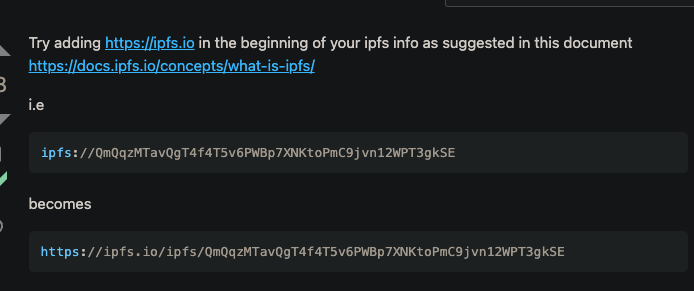

# miami-buildathon-2023

There is one ethereum smart contract for this project: `contracts/miami_bull.sol`

This contract is intended to be deployed from a web-ui project, when a new user signs up. Signup info for this project consists of only an ethereum account id. Each contract instance is deployed exactly once to the blockchain (local ganache for now) for each unique user via `web3.js` or `ethers.js`. They will have access to the source code for the contract and use that to deploy.

The web-ui project will mimic actions that a trader might do on a trading brokerage platform. As the user progresses as a trader, the system awards them badges of honor by minting NFTs for them, indicating various achievements they've made.

*NOTE:* We will be using `ganache` for this demo. As such we will have ten fully funded ETH accounts to play with.
****
This is the intended logic to interact with this smart contract for the various web-ui pages:

### Login

Every time a user logs in to the web-ui project, they will do so with an account id. The web-ui project will need to be stateful, to correlate an ethereum account id with the address of their smart contract, which the web-ui project has previously spawned & needs to know about. (The first account will be created by hand and hard-coded, to allow us to get started. Referals to be made for future accounts.)

When a login is made, the web-ui needs to call this method on the user's smart contract:
<pre>
function recordNewLogin() public returns (uint) { ... }
</pre>

The user will be awarded the right to mint their first NFT - __Successful Login Achievement__ - after they've logged in the first time.

### Deposit

When a user deposits money into the web-ui deposit page, the web-ui needs to call this smart contract method:
<pre>
function recordNewDeposit(int newDeposit) public returns (int) { }
</pre>

The smart contract keeps track of the user's balance and total deposits. It increments the deposit toal by the amount passed in.

The user will be awarded one of three levels of NFT - __DEPOSIT ACHIEVEMENT__ - after they've deposited $1, $50, or $100 dollars.

### Trade

When a user makes a trade, for simplicity's sake, we are assuming they are trading their entire available balance.  They will trade from USD to crypto or from crypto to USD. If they trade __TO__ USD, then we determine their total realized gains or losses, based upon their new balance and the total amount they deposited.

This method should be called:
<pre>
function recordNewTrade(int tradeValue, bool toDepositCurrency) public returns (uint) { }
</pre>

Nine different achievements may be awarded from this. There are three trade achievements __TRADING ACHIEVEMENT__ based upon whether it was their 1st, 10th or 50th trade, __GAINS ACHIEVEMENT__ awards based upon if they've made \$1, \$10 or \$100, and __LOSS ACHIEVEMENT__ awards which indicate that they've lost \$1, \$10, or \$100.

### Referral

1. The referral page asks for the ethereum account id of someone to be the current user would like to refer to this system. This method should be called:
<pre>
function recordNewReferral(address newReferralAccountId) public { }
</pre>

2. When a new user goes to the referral signup page, they are asked for both their own ethereum account id, and the account id of the person who referred them. This method is called (on the contract associated with the original user, not the new one):
<pre>
function verifyReferral(address newReferralAccountId) public returns (bool) { }
</pre>

If the call returns true, then the original user gets a __REFERRAL ACHIEVEMENT__ award. The new user then has their own contract deployed to the local blockchain.

### Dashboard

Calling this method:
<pre>
function getDashboard() public view returns (Dashboard memory) { }
</pre>
will return a struct with all data in it pertaining to the users status. 
This includes the number of logins, the numer of trades, their current balance and their total gains or losses.
There is also a set of achievements they've been awarded.
Finally there is a set of achievements they have minted.

##### Minting
If the user wishes to mint an NFT that they have achieved, call this method:

<pre>
function mint(Achievement thisAchievement) public returns (uint256) { }
</pre>

You will get back a token ID that can be used to retrieve the image that the NFT holds.  Also, this same token ID is returned in the above `getDashboard` call, alongside each achievement the call reports that they've minted.

##### Get URI for an NFT token ID

To convert a token id to a URI that points to the image, call this:
<pre>
function tokenURI(uint256 tokenId) { }
</pre>

This will return something like:

<pre>
"ipfs://bafybeiccfibseku6cykosr3gcqiuudvqeoycakpkrcxh4g5sy2zzrqzazq"
</pre>

Which can be converted to an image with a quick string replace:

https://stackoverflow.com/questions/68357819/how-can-i-get-the-image-url-from-ipfs-info-in-react-js
